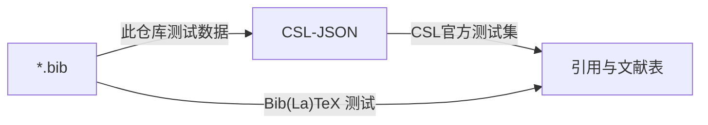

# Zotero 中文 CSL 开发组的测试文献数据

此仓库存储了三百余条文献的 [BibLaTeX](https://mirrors.ctan.org/macros/latex/contrib/biblatex/doc/biblatex.pdf) `*.bib`与 [CSL-JSON items](https://citeproc-js.readthedocs.io/en/latest/csl-json/markup.html#items) 数据，可用于开发测试 [Hayagriva](https://github.com/typst/hayagriva) 等文献转换著录工具。

这些数据用 Zotero 导出自 [Zotero 中文 CSL 开发组](https://www.zotero.org/groups/4677213/chinese_csl_development) → [群组文库](https://www.zotero.org/groups/4677213/chinese_csl_development/items) → GB/T 7714 → [GB/T 7714—2025 → 示例、测试、附录](https://www.zotero.org/groups/4677213/chinese_csl_development/collections/ZLAYMIUR/collection)。该文库主要维护者是 [Zeping Lee](https://github.com/zepinglee/)，即国标 CSL 样式当前主要开发者；不过此仓库与 Zeping Lee 无关。

这些数据未必严格符合规范，但比较接近实际使用情况。

## 数据文件及制作方式

数据位于[`data/`](./data/)，文件名`GB-T_7714—2025.{builtin,better}.{bib,json}`，共 2×2 = 4 个版本。

- `*.bib`是 BibLaTeX 数据，`*.json`是 CSL-JSON 数据。

  暂不提供 BibTeX 数据。如有需要，可自行导出或提交 GitHub issue。

- `*.builtin.*`使用 Zotero 内置功能导出，`*.better.*`使用 Zotero 插件 [Better BibTeX for Zotero](https://retorque.re/zotero-better-bibtex/) 导出。

  二者主要区别是对 Zotero 界面上「其他 | Extra」一栏的处理方式不同。

  

Zotero「其他 | Extra」一栏的情况

  此栏可以填入任意文本。使用 Zotero 直接创建文献表时，Zotero 会调用 [citeproc-js](https://citeproc-js.readthedocs.io/en/latest/) 识别此栏的作弊语法（`CSL Variable: Value`）。

  导出数据时，有以下两种处理方式。

  - 若用 Zotero 内置功能，则此栏会原样抄录到 BibLaTeX 与 CSL-JSON 的`note`字段，不识别作弊语法。
  - 若用 Better BibTeX 插件，则此栏会先识别作弊语法，再将剩余内容抄录到 BibLaTeX `annotation`字段或 CSL-JSON `note`字段。

  更多细节请移步 [Zotero](https://www.zotero.org/support/kb/item_types_and_fields#citing_fields_from_extra)、[CSL-JSON](https://citeproc-js.readthedocs.io/en/latest/csl-json/markup.html#cheater-syntax-for-odd-fields)、[Better BibTeX](https://retorque.re/zotero-better-bibtex/exporting/extra-fields/) 相应文档。

  

  

<code>*.builtin.*</code>与<code>*.better.*</code>的其它区别

  - `*.bib`：西文`title`在`*.builtin.bib`采用句子大小写，而在`*.better.bib`采用标题大小写；中文的`langid`在`*.builtin.bib`是`pinyin`，而在`*.better.bib`是`chinese`；……

  - `*.json`：`*.builtin.json`可能包含非标准字段`journalAbbreviation`，而`*.better.json`会转为`container-title-short`；……

  

  

导出所用 Better BibTeX for Zotero 设置

  [导出 | Export](https://retorque.re/zotero-better-bibtex/preferences/export/)

  - 字段 | Fields

    - [不导出的字段 | Fields to omit from export](https://retorque.re/zotero-better-bibtex/preferences/export/#fields-to-omit-from-export-comma-separated)

      留空（默认）或`file,abstract,keywords`，但不可填入`shorttitle`、`note`、`annotation`等

    - BibTeX/BibLaTeX

      - [导出语言为 | Export language as](https://retorque.re/zotero-better-bibtex/preferences/export/#export-language-as)

        `langid`（默认）

      - [当一个条目同时包含 DOI 和 URL 时，导出 | When an item has both a DOI and a URL, export](https://retorque.re/zotero-better-bibtex/preferences/export/#when-an-item-has-both-a-doi-and-a-url-export)

        全部 | `both`（默认）

  - 杂项 | Miscellaneous

    - [包含有关导出条目潜在问题的注释 | Include comments about potential problems with the exported entries](https://retorque.re/zotero-better-bibtex/preferences/export/#include-comments-about-potential-problems-with-the-exported-entries)

      ☑（并非默认）

    - [对标题应用大小写格式 | Apply title-casing to titles](https://retorque.re/zotero-better-bibtex/preferences/export/#apply-title-casing-to-titles)

      ☑（默认）

    - [使用大括号括起首字母大写的单词以保持大小写格式 | Apply case-protection to capitalized words by enclosing them in braces](https://retorque.re/zotero-better-bibtex/preferences/export/#apply-case-protection-to-capitalized-words-by-enclosing-them-in-braces)

      ☑（默认）

  

为方便对比，导出后还用[`fmt_data.py`](./scripts/fmt_data.py)统一了条目与字段排列顺序和缩进格式。

## 当前数据版本

- Zotero 9.0.5
- Better BibTeX for Zotero 9.0.36
- 群组文库最后修改于 2026-07-01 23:09:20

使用数据时，建议固定到此仓库特定 commit。

## 相关数据

[Zotero 中文社区各 CSL 样式页面](https://zotero-chinese.com/styles/GB-T-7714—2025（顺序编码，双语）/#gb-t-7714—2025-示例文献)会用「GB/T 7714—2025 示例文献」测试。[这些示例文献的数据](https://github.com/zotero-chinese/styles/blob/main/lib/data/items/gbt7714-data.json)与此仓库[`GB-T_7714—2025.builtin.json`](./data/GB-T_7714—2025.builtin.json)中对应 GB/T 7714—2025 资料性附录B的部分等同。

国标 [BibTeX](https://www.ctan.org/pkg/gbt7714)、[BibLaTeX](https://www.ctan.org/pkg/biblatex-gb7714-2015) 样式各有`*.bib`测试数据，详见 [hayagriva-gb-tracking `bib-interop/fixtures/*.md`](https://github.com/YDX-2147483647/hayagriva-gb-tracking/tree/main/bib-interop/fixtures)。

[citation-style-language/test-suite](https://github.com/citation-style-language/test-suite/) 是 CSL 官方测试集，针对 CSL 样式而非文献数据。
